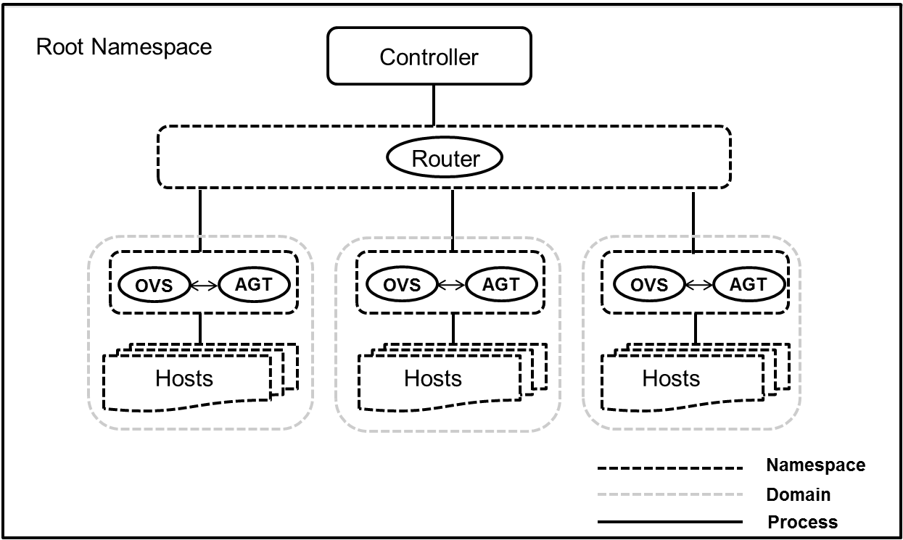
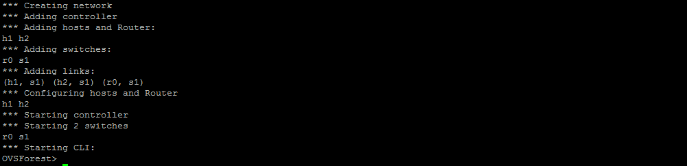
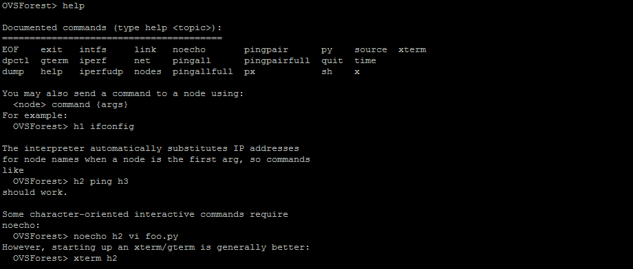
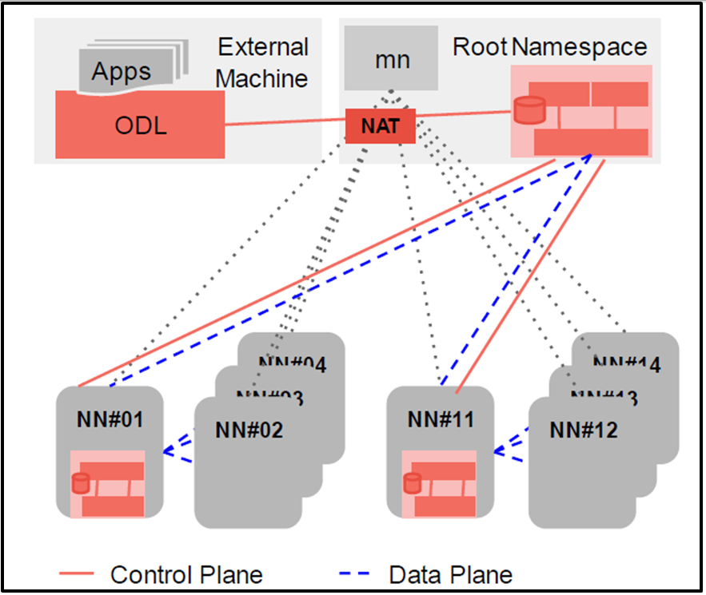

OVSForest: To realise large scale Networks
========================================================

### What is OVSForest?

OVSForest emulates a complete network of hosts, links, switches and
router on a Single machine to realise large scale networks. It executes
seprate service of ovs-vswitchd with corresponding ovsdb-server on different 
named network namespaces.

OVSForest is useful for interactive developement, testing and demos,
espicially those using OpenFlow and SDN on large scale networks.

### System architecture

### How does it work?

OVSForest creates virtual networks using process-based virtualization
and network namespaces - features that are available in recent Linux
kernels.  In OVSForest, hosts are emulated as `bash` processes running in
a network namespace, so any code that would normally run on a Linux
server (like a web server or client program) should run just fine
within a OVSForest "Host".  The OVSForest "Host" will have its own private
network interface and can only see its own processes.  Switches in
OVSForest are software-based OpenFlow switches Links are virtual ethernet 
pairs, which live in the Linux kernel and connect our emulated switches 
to emulated hosts(processes).
* Controller can be any openflow controller that can be used to manage 
openflow switches.
* Router is simply a host that works to manage route between switches
and controller, It works in a seprate namespace named as mn-r0. Here the 
name of router r0 is fixed.
* Switches are the OpenFlow switches that manages the traffic.
* Hosts are simply nodes to create network topology of Switches and hosts.

### Features

* Each switch initiates a different vswitchd process.
* Each switch maintains its own database.
* Router manages the swithces to talk to the host machine.
* X11 tunneling (wireshark in Mininet hosts, finally!)
* Switches and hosts work in different namespaces
* vxlan interfaces added in switch namespaces

* A command-line launcher (`ovsforest`) to instantiate networks.
  Default network would be:

    *** Creating network\n
    *** Adding controller\n
    *** Adding hosts and Router:\n
    h1 h2
    *** Adding switches:
    r0 s1
    *** Adding links:
    (h1, s1) (h2, s1) (r0, s1)
    *** Configuring hosts and Router
    h1 h2
    *** Starting controller
    *** Starting 2 switches
    r0 s1
    *** Starting CLI:
    OVSForest>

* A handy Python API for creating networks of varying sizes and
  topologies.

* Examples (in the `examples/ovsforest.py` directory) to help you get started.

* Parametrized topologies (`Topo` subclasses) using the Mininet
  object.  For example, a linear network may be created with the
  command:

  `ovsforest --topo linear,3`

* A command-line interface (`CLI` class) which provides useful
  diagnostic commands (like `iperf` and `ping`), as well as the
  ability to run a command to a node. For example,

  `OVSForest> help`

  `OVSForest> help

  Documented commands (type help <topic>):
  ========================================
  EOF    exit   intfs     link   noecho       pingpair      py    source  xterm
  dpctl  gterm  iperf     net    pingall      pingpairfull  quit  time
  dump   help   iperfudp  nodes  pingallfull  px            sh    x

  You may also send a command to a node using:
    <node> command {args}
  For example:
    OVSForest> h1 ifconfig

  The interpreter automatically substitutes IP addresses
  for node names when a node is the first arg, so commands
  like
    OVSForest> h2 ping h3
  should work.

  Some character-oriented interactive commands require
  noecho:
    OVSForest> noecho h2 vi foo.py
  However, starting up an xterm/gterm is generally better:
    OVSForest> xterm h2

  OVSForest>`

  `OVSForest> h1 ifconfig -a`
  tells host h11 to run the command `ifconfig -a`

  `OVSForest net`
   shows the topology, below is the output of default topology
   `OVSForest> net
   h1 h1-eth0:s1-eth2
   h2 h2-eth0:s1-eth3
   r0 r0-eth1:s1-eth1
   s1 s1-eth1:r0-eth1 s1-eth2:h1-eth0 s1-eth3:h2-eth0
   c0
   OVSForest>`

* A "cleanup" command to get rid of junk (interfaces, processes, files
  in /tmp, etc.) which might be left around by Mininet or Linux. Try
  this if things stop working!

  `ovsforest -c`

### How to use?

#### Prerequisite

One host that runs OVSForest is required. 
The following operating system is only supported.

* Ubuntu 12.04.4 LTS Desktop (amd64)
* Brctl module must be there in base machine
  `apt-get install bridge-utils`
* Create one network name space by
  `ip netns create NAME`
If user doesn't perform this step then cgroups will not get loaded 
and any attempt by the ovsforest to create namespace will fail.
* Open Flow Switch must be installed

OpenFlow Switch is unmodified Open vSwitch (version 2.0.X). It is not
included in this software suite. For detailed information on Open
vSwitch, please visit [http://openvswitch.org/](http://openvswitch.org/).

* schema file vswitchd/vswitch.ovsschema must be at /tmp/ (If you want to
  change the location then change it in node.py )

### Installation

* Download OVSForest Source code from git
* install source code by 
  `util/install -a` or `util\install.sh -n`
* Set IPv4 forwarding and proxy arp on host machine to enable host machine
to talk to switches ( if not configured )
   `/proc/sys/net/ipv4/conf/r1/proxy_arp`
   `/proc/sys/net/ipv4/ip_forward`
* Set route for host machine in router (r0) machine.
* Set default gateway on switches and hosts as per node connectivity.

### Confirmation Steps

* Controller and vxlan bridge is there on base machine with configured IP 
* Base machine can ping switches successfully.
* Switches can ping base machine successfully.

### Cleanup

* Cleanup for OVSForest is under developement, So you may have to remove
interfaces manually, that didn't get removed from host even after 
successful exit.
* It is already obseved that sometimes interfaces of vxlan plane are not
removed from base machine. So we have to remove them manually.
* If by any reason the process terminates then you manually have to kill 
ovs-vswithcd ovsdb-server and any other process that user launched on nmaespaces. 

### Limitations

* OVSForest supports only linear topology.
* Switches can talk upto host machine only.
* Work in Prototyping stage for a linear topology with 1 control domain

### Examples
You can move your openflow controller to external environment using NAT.
Following architecture shows how we can use NAT to move controller

If you want to create a user specific topology then `examples/ovsforest.py` 
can help you to realise the desired topology.
Let say a experimenter want to create a topology with 3 switches with each 
switch connected to 5 hosts. Then he simply have to create host by `addHost` 
API, create switch by `addSwitch` API and link them in a way he wants using 
`addLink` API.
* While using this file first connect router with the swithes as the first link 
and then connect the switches with the host.
* Name of the router `r0` is fixed in the code so we must have to use the same.

###Future Plans
Following are the work on which ovsforest team is currently focused
* Deploy Virtual Network agent `https://github.com/trema/virtual-network-platform`
on OVS switches
* Delopy neutron agent ( Openstack ) on OVS swithces

