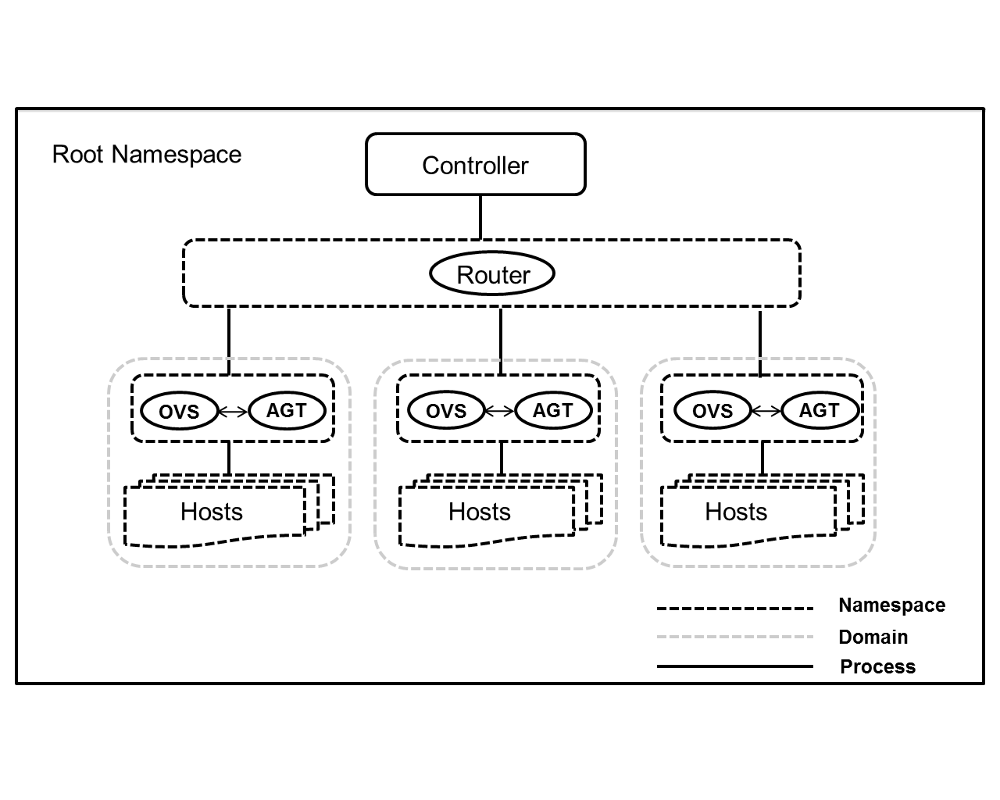

OVSForest: To realise large scale Networks
========================================================

### What is OVSForest?

OVSForest emulates a complete network of hosts, links, switches and
router on a Single machine To create a sample two hosts, and one-switch
network on differnt namespaces just run:

 `sudo mn`

OVSForest is useful for interactive developement, testing and demos,
espicially those using OpenFlow and SDN. Vxlan tunneling interfaces 
are also provided in the Switches for testing tunneling

### System architecture

### How does it work?

OVSForest creates virtual networks using process-based virtualization
and network namespaces - features that are available in recent Linux
kernels.  In OVSForest, hosts are emulated as `bash` processes running in
a network namespace, so any code that would normally run on a Linux
server (like a web server or client program) should run just fine
within a OVSForest "Host".  The OVSForest "Host" will have its own private
network interface and can only see its own processes.  Switches in
OVSForest are software-based OpenFlow switches Links are virtual ethernet 
pairs, which live in the Linux kernel and connect our emulated switches 
to emulated hosts(processes).
* Controller can be any openflow controller that can be used to manage 
openflow switches.
* Router is simply a host that works to manage route between switches
and controller, It works in a seprate namespace named as mn-r0. Here the 
name of router r0 is fixed.
* Switches are the OpenFlow switches that manages the traffic.
* Hosts are simply nodes to create network topology of Switches and hosts.

### Features

* Each switch initiates a different vswitchd process.
* Each switch maintains its own database.
* Router manages the swithces to talk to the host machine.
* X11 tunneling (wireshark in Mininet hosts, finally!)
* Switches and hosts work in different namespaces
* vxlan interfaces added in switch namespaces

* A command-line launcher (`mn`) to instantiate networks.

* A handy Python API for creating networks of varying sizes and
  topologies.

* Examples (in the `examples/ovsforest.py` directory) to help you get started.

* Parametrized topologies (`Topo` subclasses) using the Mininet
  object.  For example, a linear network may be created with the
  command:

  `mn --topo linear,3`

* A command-line interface (`CLI` class) which provides useful
  diagnostic commands (like `iperf` and `ping`), as well as the
  ability to run a command to a node. For example,

  `mininet> h11 ifconfig -a`

  tells host h11 to run the command `ifconfig -a`

* A "cleanup" command to get rid of junk (interfaces, processes, files
  in /tmp, etc.) which might be left around by Mininet or Linux. Try
  this if things stop working!

  `mn -c`

### How to use?

#### Prerequisite

One host that runs OVSForest is required. 
The following operating system is only supported.

* Ubuntu 12.04.4 LTS Desktop (amd64)
* Brctl module must be there in base machine
  `apt-get install bridge-utils`
* Create one network name space by
   `ip netns create NAME`
* Openvswitch Switch must be installed

##### OpenFlow Switch

OpenFlow Switch is unmodified Open vSwitch (version 2.0.X). It is not
included in this software suite. For detailed information on Open
vSwitch, please visit [http://openvswitch.org/](http://openvswitch.org/).

* schema file vswitchd/vswitch.ovsschema must be at /tmp/ (If you want to
  change the location then change it in node.py )

### Installation

* Download OVSForest Source code from git
* install source code by 
  `util/install -n`
* Set IPv4 forwarding and proxy arp on host machine to enable host machine
to talk to switches ( if not configured )
   `/proc/sys/net/ipv4/conf/r1/proxy_arp`
   `/proc/sys/net/ipv4/ip_forward`
* Set route for host machine in router (r0) machine.
* Set default gateway on switches and hosts as per node connectivity.

### Confirmation Steps

* Controller and vxlan bridge is there on base machine with configured IP 
* Base machine can ping switches successfully.
* Switches can ping base machine successfully.

### Cleanup

* Cleanup for OVSForest is under developement, So you may have to remove
interfaces manually, that didn't get removed from host even after 
successful exit.
* It is already obseved that sometimes interfaces of vxlan plane are not
removed from base machine. So we have to remove them manually.

### Limitations

* OVSForest supports only linear topology.
* Switches can talk upto host machine only.
* Work in Prototyping stage for a linear topology with 1 control domain

### Examples

